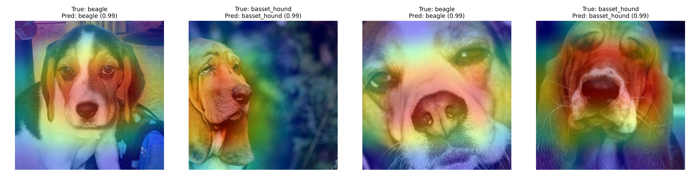

# DD2424-project - Transfer Learning
This repo contains a course project in Deep Learning (DD2424) at KTH Royal Institute of Technology. The goal was to explore trainsfer learning on image classification tasks.



## Dataset :cat: :dog:
Project is using the [Oxford Pets dataset](https://www.robots.ox.ac.uk/~vgg/data/pets/). \
Original image width: 600, height: 400.

## Setup :rocket:
1) Clone repo: `git clone git@github.com:simonwanna/DD2424-project.git && cd DD2424-project` 
2) Create env: `conda env create -f environment.yaml && conda activate dd2424`
3) Get the data:

```bash
mkdir data && cd data
wget https://thor.robots.ox.ac.uk/~vgg/data/pets/images.tar.gz
wget https://thor.robots.ox.ac.uk/~vgg/data/pets/annotations.tar.gz
tar -xvzf images.tar.gz
tar -xvzf annotations.tar.gz
rm images.tar.gz annotations.tar.gz
```

## Train and test :computer:
run bash script: `bash preprocess.sh`, change arguments in file
run training: `bash train.sh`, change path/rguments in file
run testing: `bash test.sh`, choose model in file

## Results :bar_chart:
Best binary classification of cat vs dog.
- val: 0.986
- test: 0.989

Best multiclass classification of 37 breed classes.
- val: 0.916
- test: 0.925